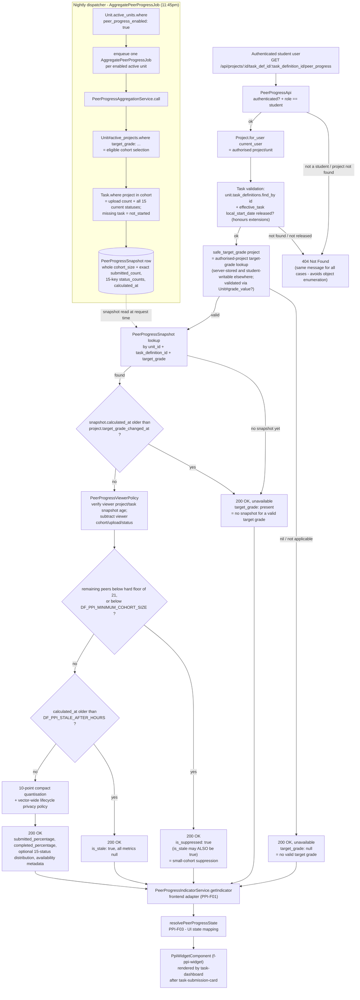

# Peer Progress Indicator — Backend Data-Source Map

**Ticket:** PPI-D02 — Publish the peer-progress backend data-source and field-ownership map
**Status:** Updated for the production API PR #60 contract.
**Builds on:** [PPI API discovery](./task-completion-data-discovery.md) — the earlier starter task that
located existing task-completion data (`Task`, `TaskStatus`, `Project#task_stats`,
`Unit#student_task_completion_stats`) and found it was not reachable by students. This document goes
one level deeper: it maps the current backend implementation against the agreed PPI response contract,
field by field, and records what is still open.

## Implementation status

PPI-B01 was developed on `ppi/student-progress-endpoint` and merged into the shared
`feature/peer-progress-indicator` branch through API PR #16 (merge commit `1e011b12`). The source branch
has since been deleted. Everything marked "available" below is therefore available on the shared
objective branch; the PR #16 head (`91d4db95`) remains the useful review snapshot for the implementation.

This document records that baseline plus the additive detailed lifecycle,
completion, privacy, and profile-preference work in API PR #60.

---

## 1. Backend data-source table

| File | Class / method | Branch | Role |
|---|---|---|---|
| `app/api/peer_progress_api.rb` | `PeerProgressApi` (Grape API), `get '/projects/:id/task_def_id/:task_definition_id/peer_progress'` | `feature/peer-progress-indicator` (PPI-B01, merged via #16) | Student-facing endpoint. Authorises the request, looks up the stored snapshot, applies suppression/staleness rules, returns the allowlisted response. |
| `app/models/peer_progress_snapshot.rb` | `PeerProgressSnapshot` | API PR #60 | One row per `(unit, task_definition, target_grade)`. Stores internal whole-cohort `cohort_size`, exact `submitted_count`, all 15 raw `status_counts`, compatibility `submitted_percentage`, and `calculated_at`. Validates exact counts fit/cover the cohort. Raw counts never cross the student API boundary. |
| `app/services/peer_progress_aggregation_service.rb` | `PeerProgressAggregationService.call(unit:, calculated_at:)` | API PR #60 | Batch job logic. For each grade value, counts uploads and every canonical current task status. A missing task row contributes to `not_started`, so each cohort member contributes exactly once per task. |
| `app/services/peer_progress_viewer_policy.rb` | `PeerProgressViewerPolicy.build`, `.public_metrics` | API PR #60 | Subtracts the authenticated viewer's project, exact upload contribution, and status before applying the remaining-peer floor, compact quantisation, or detailed-vector policy. Fails closed if the viewer project/task changed after the snapshot or an exact aggregate is incomplete. |
| `app/services/peer_progress_distribution_policy.rb` | `PeerProgressDistributionPolicy` | API PR #60 | Defines the 15-key canonical order, 10-point quantisation, and the vector-wide feasible-count ambiguity check. A detailed vector is released only when every status retains at least two possible raw counts even if the observer knows the cohort size. |
| `app/sidekiq/aggregate_peer_progress_job.rb` | `AggregatePeerProgressJob#perform(unit_id = nil)` | `feature/peer-progress-indicator` (PPI-B01, merged via #16) | Scheduled dispatcher selects active, PPI-enabled units and enqueues one job per unit. Each per-unit job rechecks active/enabled state before calling the aggregation service. Scheduled via `config/schedule.yml` — `"every day at 11:45pm"`. |
| `db/migrate/20260809153000_create_peer_progress_snapshots.rb` | — | `feature/peer-progress-indicator` (PPI-B01, merged via #16) | Creates `peer_progress_snapshots` table. Comment in the migration explicitly flags `cohort_size` as "Internal only. Never expose this raw value through the student API." |
| `db/migrate/20260810033824_add_peer_progress_enabled_to_units.rb` | — | `feature/peer-progress-indicator` (PPI-B01, merged via #16) | Adds `units.peer_progress_enabled` boolean, `default: false, null: false`. |
| `app/models/unit.rb` | `Unit#active_projects` | `feature/peer-progress-indicator` (pre-existing) | Reused as the base scope for cohort selection (`unit.active_projects.where(target_grade: …)`). |
| `app/models/unit.rb` | `Unit#grade_value?` | `feature/peer-progress-indicator` (pre-existing) | Reused to validate a project's `target_grade` is actually a value the unit has enabled, both when aggregating and when deriving the safe target grade for a request. |
| `app/models/unit.rb` | `Unit.active_units` | `feature/peer-progress-indicator` (pre-existing) | Reused so the nightly dispatcher skips inactive units. The job further scopes this relation to `peer_progress_enabled: true`. |
| `app/models/project.rb` | `Project.for_user(user, include_inactive)` | `feature/peer-progress-indicator` (pre-existing) | Reused to authorise that the requested project actually belongs to the authenticated student. |
| `app/models/task.rb` | `Task#file_uploaded_at` | `feature/peer-progress-indicator` (pre-existing column) | The signal used to decide whether a task counts as "submitted" for aggregation — see note below, this is **not** the same signal the original discovery task found. |
| `app/models/project.rb` | `Project#target_grade_changed_at`, `#record_target_grade_change` (`before_create`/`before_update` callback) | `feature/peer-progress-indicator` (PPI-B01, merged via #16) | New column + callback. Records when a student's target grade last changed, so a snapshot calculated *before* a grade change is never shown as if it applied to the new grade. Backfill migration sets it to "now" for all existing projects — see §5. |
| `db/migrate/20260818160804_add_target_grade_changed_at_to_projects.rb` | — | `feature/peer-progress-indicator` (PPI-B01, merged via #16) | Adds `projects.target_grade_changed_at` with a retained database `CURRENT_TIMESTAMP` default for rolling-deploy compatibility, backfills existing rows to the migration run time, then applies `NOT NULL`. |
| `db/migrate/20260824000002_ensure_target_grade_changed_at_default.rb` | — | Release readiness | Idempotently restores the retained `CURRENT_TIMESTAMP` default for development or staging databases that recorded the earlier migration before its rolling-deploy fix was added. Fresh databases already satisfy the invariant, so this migration performs no schema change there. |
| `db/migrate/20260824000003_add_detailed_peer_progress.rb` | — | API PR #60 | Adds internal exact `peer_progress_snapshots.submitted_count`, `status_counts` JSON, and `users.display_peer_progress` with `default: true, null: false`. Existing snapshot rows retain null exact aggregates and fail closed until re-aggregated. |
| `app/api/units_api.rb`, `app/api/entities/unit_entity.rb` | `PUT /units/:id` accepts `peer_progress_enabled`; `UnitEntity` exposes it gated by `can_read_unit_config?` | `feature/peer-progress-indicator` (PPI-B01, merged via #16) | Convenors can toggle PPI on/off through the normal unit-update endpoint. Visibility remains staff-only, matching the "students never see raw config" pattern. |
| `app/api/users_api.rb`, `app/api/entities/user_entity.rb` | `PUT /users/:id`, `Entities::UserEntity` | API PR #60 | Persists and exposes the user's `display_peer_progress` opt-out. It defaults on; when false, the PPI endpoint returns no metrics. |

### Divergence from the original discovery task

The [earlier discovery](./task-completion-data-discovery.md) found `Unit#student_task_completion_stats`
and `Project#task_stats` as existing, reusable aggregation infrastructure, built on `TaskStatus.complete`.
**PPI-B01 does not reuse either of them.** It introduces a parallel, PPI-specific path instead:

- Compatibility submission signal: `Task.where(...).where.not(file_uploaded_at: nil)`.
- Compact completion signal: the current status is exactly `TaskStatus.complete`.
- Advanced signal: one mutually exclusive count for each of all 15 canonical statuses.
- Storage: a new `PeerProgressSnapshot` table, calculated nightly, not the ad-hoc per-request
  `Unit#student_task_completion_stats` calculation.

This looks like a deliberate design choice (a stored nightly snapshot makes the suppression/staleness
checks in the student-facing endpoint cheap and simple), not an oversight. It's recorded here so nobody
assumes the two paths are the same thing, and so **PPI-T01** (calculation rules) has an accurate
starting point. API PR #60 now exposes both meanings explicitly rather than
labelling upload presence as task completion.

---

## 2. PPI field-ownership table

Response contract as implemented in `PeerProgressApi#peer_progress_payload` on
API PR #60. It is an additive 15-field allowlist; the canonical, deployment
contract is maintained in [`docs/peer-progress-api.md`](../peer-progress-api.md).

| Field | Purpose | Current backend source | Available / Calculated / Missing | Transformation | Owning ticket |
|---|---|---|---|---|---|
| `task_definition_id` | Task context | Request param, validated via `unit.task_definitions.find_by(id:)` | Available | Passthrough of the validated ID | PPI-B01 |
| `unit_id` | Unit context | `project.unit_id` | Available | Passthrough | PPI-B01 |
| `target_grade` | Authorised-project target-grade lookup | `Project#target_grade`, validated through `Unit#grade_value?` inside `safe_target_grade` | Available (validated, not a raw column read) | Returns `nil` if the project has no target grade or it isn't enabled for the unit. This route accepts only `:id` and `:task_definition_id`, so a grade cannot be supplied directly to this request. However, `Project#target_grade` is student-writable through the existing project-update API: it is server-stored, not server-controlled. The timestamp guard withholds older snapshots until the next aggregation, but does not permanently bind a student to one grade band. See §5. | PPI-B01 / PPI-S01 |
| `submitted_percentage` | Anonymous peer submitted percentage | Exact internal `submitted_count`, minus the viewer's upload contribution | Calculated (batch plus request-time viewer subtraction) | Quantised to the nearest 10 points over remaining peers. The stored compatibility percentage is not used to reconstruct an exact count. Null for suppressed/stale/disabled/unavailable or legacy snapshots. | API PR #60 |
| `completed_percentage` | Truthful compact peer completion percentage | Internal `status_counts['complete']`, minus the viewer if complete | Calculated | Independently quantised to 10 points over remaining peers; `nil` for suppressed/stale/disabled/unavailable states or incomplete exact snapshots. | API PR #60 |
| `status_distribution` | Advanced full lifecycle bar | Internal exact 15-key `status_counts` | Calculated | Ordered array of `{status, percentage}`. Entire vector is `null` unless above the cohort floor and every status retains at least two feasible counts after considering all buckets together. | API PR #60 |
| `distribution_available`, `distribution_unavailable_reason` | Detailed-mode availability | Distribution privacy policy and overall state | Calculated | Reasons are neutral (`privacy_protection`, `detailed_data_unavailable`, or the applicable overall reason) and never identify a sensitive category. | API PR #60 |
| `is_suppressed` | Small-cohort suppression | Computed per-request after subtracting the viewer: `peer_cohort_size < minimum_cohort_size!` (hard floor 21) | Calculated | Raw whole/peer cohort sizes are never returned. The default requires at least 22 stored active projects so 21 other students remain. Empty and small peer cohorts share the same response. Can be true with `is_stale`. | API PR #60 / PPI-S01 |
| `is_stale` | Data freshness | Computed per-request: `snapshot.calculated_at < ENV['DF_PPI_STALE_AFTER_HOURS'].hours.ago` | Calculated | Computed once and threaded through every branch, so it can appear alongside `is_suppressed: true` in the same response — see above. | PPI-T01 (approve the freshness window) / PPI-B01 (implementation) |
| `is_feature_enabled` | Whether PPI is on for this unit | `units.peer_progress_enabled` column, `default: false`; settable via `PUT /units/:id` | Available | None | Unit-level config remains convenor-controlled for normal units. The demo-only `db:ppi_sample_data` task opts its synthetic `PPI1001` / `PPI1002` units in on both first run and rerun. See §5. |
| `is_user_enabled` | Whether this user wants PPI displayed | `users.display_peer_progress`, default true/non-null; settable via `PUT /users/:id` | Available | False gates all peer metrics even when the unit feature is enabled. | API PR #60 |
| `last_updated_at` | Snapshot freshness display | `snapshot.calculated_at.utc.iso8601` | Available when a snapshot exists, else `nil` | ISO 8601 UTC string | PPI-B01 / PPI-F01 (display formatting) |
| `unavailable_message` | Safe unavailable message | Hardcoded Ruby constants in `PeerProgressApi` (`UNAVAILABLE_MESSAGE`, etc.) | Available, but **placeholder wording** | None | PPI-D01 — user-facing wording is explicitly out of scope for PPI-B01; the current strings are implementation placeholders, not approved copy. |
| `unavailable_reason` | Safe machine-readable compact state | `PeerProgressApi#peer_progress_result` | Calculated | One of `user_disabled`, `feature_disabled`, `target_grade_unavailable`, `snapshot_unavailable`, `insufficient_cohort`, `aggregation_incomplete`, or `stale`; `null` on compact success. | API PR #60 |

### Fields the response must never include (confirmed by code review)

`peer_progress_payload` is an allowlist — it only ever builds the 15 public fields. Confirmed absent:
peer names, usernames, student IDs, peer project IDs, marks, feedback, individual peer task records,
raw `status_counts`, raw `cohort_size`, and submitted/completed counts. The migration comment on `cohort_size`
explicitly flags it as internal-only. This satisfies acceptance criterion 6 based on the code merged
through API PR #16. That PR received a privacy-focused independent review and corrective commit; the
dedicated PPI-S01 ticket should still decide the explicitly retained risks listed in §5 against the
merged code and deployment settings.

---

## 3. Proposed / actual data-flow diagram

---

## 4. Safe example responses

The canonical 15-field normal response, lifecycle order, nullability, state
reasons, preference semantics, and privacy explanation are maintained in
[`docs/peer-progress-api.md`](../peer-progress-api.md). Keeping a second JSON copy
here previously allowed the handover map to drift behind the production
contract, so this document now links to the tested source of truth.

---

## 5. Confirmed status, gaps and unresolved decisions

| # | Gap / decision | Detail | Owner |
|---|---|---|---|
| 1 | **Backend merged** | PPI-B01 merged through API PR #16 at `1e011b12`; the implementation is present on `feature/peer-progress-indicator` and the source branch was deleted. | PPI-B01 (complete) |
| 2 | **Frontend task adapter is live** | `PeerProgressIndicatorService.getIndicator(projectId, taskDefinitionId)` calls the authorised project/task route and maps the additive 15-field response. Unit, grade, mock state, and raw cohort values are not client-supplied. | PPI-F01 (implemented) |
| 3 | **Two distinct frontend PPI contracts** | `PeerProgressIndicator` / `PeerProgressIndicatorService` is the live task-level API adapter. `PeerProgressResponse` / `PeerProgressService` is the separate weekly burndown contract. They are intentionally not interchangeable; weekly demo fixtures remain separate from the live task request. | PPI-F01 / burndown API owner |
| 4 | **Production config still needs approval** | `doubtfire-deploy` 11.0.x supplies local-development values in `development/api.env` and both Compose files: `DF_PPI_MINIMUM_COHORT_SIZE=21` and `DF_PPI_STALE_AFTER_HOURS=48`. Production must supply separately reviewed values. The API rejects a cohort setting below the hard floor of 21, and the floor is coupled to the 10-point percentage bucket by tests. | PPI-T01 / PPI-S01 (approve production values) |
| 5 | **Demo sample units are privacy-floor and advanced-mode ready** | Both demo tasks remain triple-guarded. `db:all_features_demo` creates 25 total students, leaving 24 peers for the demo viewer, with seven visible lifecycle states. Read-only verify uses the production viewer and public-metrics policies. `db:ppi_sample_data` provisions at least configured peer floor + 1 total and validates public metrics for every viewer/snapshot. | API PR #60 / deploy PR #12 |
| 6 | **Placeholder wording** | `unavailable_message` strings are hardcoded in Ruby, written by whoever built PPI-B01, not reviewed for tone/wording. | PPI-D01 |
| 7 | **Detailed distribution is vector-checked** | Independent 10-point status buckets can jointly reveal exact counts even though each bucket alone is ambiguous (for example, cohort 24 split 6/18). API PR #60 therefore withholds the entire vector unless every status retains at least two feasible raw counts when all buckets and a known cohort size are considered. Compact values remain independently protected. Target-grade switching remains timestamp-gated as described below. | API PR #60 / PPI-S01 |
| 8 | **Backfill invalidates snapshots in already-running PPI environments** | `add_target_grade_changed_at_to_projects` backfills existing projects to migration time, so any snapshot calculated before that time is withheld until aggregation runs again. On the first deployment of the complete PPI migration series the snapshot table is created empty, so there is nothing to invalidate. This matters to development or staging environments that ran the earlier snapshot migration and aggregation before applying the later timestamp migration. | PPI-B01 (deploy sequencing) |
| 9 | **Suppression and staleness are not mutually exclusive** | `is_suppressed` and `is_stale` can both be `true`. The current frontend `resolvePeerProgressState` checks `isSuppressed` before `isStale`, so a suppressed-and-stale response resolves to the "hidden" UI state. PPI-F01/PPI-F03 should confirm that priority is intentional. | PPI-F01 / PPI-F03 |

---

## 6. Explicitly out of scope for this document

This document does not implement the backend endpoint (PPI-B01), the frontend adapter (PPI-F01), the
unit-level component (PPI-F02), percentage calculation rules (PPI-T01), loading/error states (PPI-F03),
the dedicated security follow-up (PPI-S01), or user-facing wording (PPI-D01). It does not create another
mock-data service or another minimal test-data task. Where this document identifies a security-relevant
boundary (§2, §5), that observation does not replace PPI-S01 sign-off on the retained risks.
